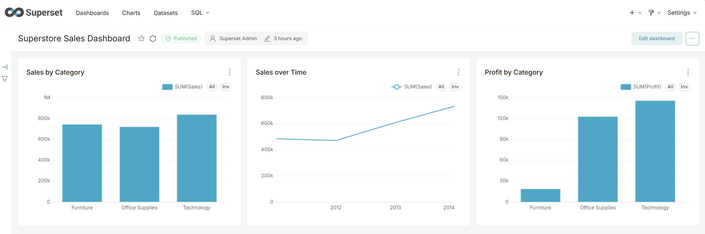

# Superstore Sales Analysis

Dieses Projekt zeigt die schrittweise Entwicklung einer Datenanalyse zu
einem ersten **AI-Data-Agent-Prototyp**.

Ausgehend von einem Superstore-Datensatz werden die Daten zunächst mit
Python und Pandas analysiert, anschließend in PostgreSQL gespeichert,
mit Apache Superset visualisiert und schließlich über ein Sprachmodell
mit natürlichsprachlichen Fragen abgefragt.

## Projektübersicht

``` text
CSV
 ↓
Pandas
 ↓
PostgreSQL
 ├──→ Apache Superset → Dashboard
 ↓
LLM → SQL-Generierung → Sicherheitsprüfung → PostgreSQL
                                             ↓
                                      Abfrageergebnis
                                             ↓
                                            LLM
                                             ↓
                                  Verständliche Antwort
```

## Projektstruktur

``` text
superstore-sales-analysis/
│
├── README.md
├── data/
│   └── Superstore.csv
│
├── notebooks/
│   └── superstore_sales_analysis.ipynb
│
└── docs/
    └── images/
        ├── superstore_linkedin.png
        └── superset-dashboard.png
```

------------------------------------------------------------------------

## Phase 1: Datenanalyse mit Pandas

In der ersten Phase werden die Verkaufsdaten mit Python und Pandas
untersucht.

### Fragestellungen

-   Wie entwickeln sich Umsatz und Gewinn?
-   Welche Kategorien und Produkte sind profitabel?
-   Welche Produkte verursachen Verluste?
-   Welchen Einfluss haben Rabatte auf den Gewinn?
-   Welche Regionen und Kundensegmente sind besonders erfolgreich?
-   In welchen Monaten ist das Geschäft stark oder schwach?

### Verwendete Daten

Der Datensatz enthält unter anderem:

-   Bestelldatum
-   Produktname und Produktkategorie
-   Umsatz (`Sales`)
-   Gewinn (`Profit`)
-   Rabatt (`Discount`)
-   verkaufte Menge (`Quantity`)
-   Region
-   Kundensegment

### Durchführung

Zunächst wurde die CSV-Datei mit Pandas geladen und kontrolliert.
Anschließend wurden:

1.  Umsatz und Gewinn nach Jahr analysiert,
2.  Kategorien und Unterkategorien verglichen,
3.  Gewinnmargen berechnet,
4.  Produkte mit dem höchsten Umsatz und Gewinn ermittelt,
5.  Produkte und Unterkategorien mit Verlust identifiziert,
6.  der Zusammenhang zwischen Rabatt und Gewinn untersucht,
7.  Regionen und Kundensegmente verglichen,
8.  die monatliche Entwicklung von Umsatz und Gewinn analysiert,
9.  Ergebnisse mit Tabellen und Diagrammen dargestellt.

### Wichtigste Ergebnisse

-   Umsatz und Gewinn sind insgesamt gestiegen.
-   2014 war das erfolgreichste Jahr.
-   Technology ist die profitabelste Kategorie.
-   Furniture erzielt viel Umsatz, aber nur wenig Gewinn.
-   Tables und Bookcases verursachen Verluste.
-   Rabatte über 20 % sind insgesamt nicht rentabel.
-   West ist die profitabelste Region.
-   Central hat die niedrigste Gewinnmarge.
-   Consumer bringt den höchsten Gesamtgewinn.
-   Home Office hat die höchste Gewinnmarge.
-   November und Dezember sind besonders starke Monate.
-   Juli 2011 und Januar 2012 waren die einzigen Verlustmonate.

### Fazit der Datenanalyse

Die Analyse zeigt, dass ein hoher Umsatz nicht automatisch einen hohen
Gewinn bedeutet. Besonders hohe Rabatte sowie einzelne Produkte und
Unterkategorien reduzieren die Rentabilität.

------------------------------------------------------------------------

## Phase 2: PostgreSQL-Integration

Nach der Datenanalyse wurde der Datensatz in einer PostgreSQL-Datenbank
gespeichert.

Dafür wurden:

1.  die PostgreSQL-Datenbank `superstore_db` erstellt,
2.  Python mithilfe von SQLAlchemy mit PostgreSQL verbunden,
3.  der Pandas-DataFrame als Tabelle `superstore_sales` gespeichert,
4.  die erfolgreiche Übertragung mit einer SQL-Abfrage kontrolliert.

Beispiel:

``` sql
SELECT *
FROM superstore_sales
LIMIT 10;
```

### Datenfluss

``` text
CSV → Pandas → SQLAlchemy → PostgreSQL → SQL-Abfrage
```

------------------------------------------------------------------------

## Phase 3: Reporting mit Apache Superset

Im nächsten Schritt wurde die PostgreSQL-Datenbank mit Apache Superset
verbunden.

Ziel war es, auf Basis der bereits vorhandenen Daten ein einfaches
BI-Dashboard zu erstellen, ohne die Visualisierungen erneut mit Python
programmieren zu müssen.

Das **Superstore Sales Dashboard** enthält:

-   Sales by Category
-   Sales over Time
-   Profit by Category

### Datenfluss

``` text
PostgreSQL → Apache Superset → Dashboard
```

### Dashboard



Apache Superset ermöglicht damit eine zusätzliche Reporting-Schicht auf
den bereits in PostgreSQL gespeicherten Daten.

------------------------------------------------------------------------

## Phase 4: Erster AI-Data-Agent-Prototyp

Nach Datenanalyse, Datenbankintegration und Reporting wurde der erste
KI-Baustein integriert.

Ziel ist es, Fragen über die Verkaufsdaten in natürlicher Sprache
stellen zu können, ohne die benötigte SQL-Abfrage manuell schreiben zu
müssen.

### Ablauf

``` text
Frage in natürlicher Sprache
        ↓
       LLM
        ↓
Generierte PostgreSQL-Abfrage
        ↓
SQL-Sicherheitsprüfung
        ↓
   PostgreSQL
        ↓
 Abfrageergebnis
        ↓
       LLM
        ↓
Verständliche Antwort
```

### Funktionsweise

1.  Der Benutzer stellt eine Frage in natürlicher Sprache.

    Beispiel:

    > Welche Region hatte den höchsten Umsatz?

2.  Die Frage wird zusammen mit Informationen über die Tabelle und
    relevante Spalten an ein OpenAI-Sprachmodell übergeben.

3.  Das Modell generiert eine passende PostgreSQL-`SELECT`-Abfrage.

    Beispiel:

    ``` sql
    SELECT "Region", SUM("Sales") AS total_sales
    FROM superstore_sales
    GROUP BY "Region"
    ORDER BY total_sales DESC
    LIMIT 1;
    ```

4.  Vor der Ausführung wird das generierte SQL durch eine
    Sicherheitsprüfung kontrolliert.

    Der aktuelle Prototyp erlaubt ausschließlich lesende
    `SELECT`-Abfragen und soll verhindern, dass generiertes SQL Daten in
    der Datenbank verändert.

5.  Die validierte Abfrage wird gegen PostgreSQL ausgeführt.

6.  Das Datenbankergebnis wird anschließend an das Sprachmodell
    übergeben und in eine kurze, verständliche Antwort umgewandelt.

    Beispiel:

    > Die Region West erzielte mit 725.457,82 den höchsten Umsatz.

### Bisherige Tests

Der Prototyp wurde unter anderem mit folgenden Fragen getestet:

-   Welche Kategorie hatte den höchsten Gewinn?
-   Welche Region hatte den höchsten Umsatz?

Bei beiden Tests wurde der vollständige Ablauf erfolgreich durchgeführt:

``` text
Frage
 ↓
SQL-Generierung
 ↓
Sicherheitsprüfung
 ↓
PostgreSQL-Abfrage
 ↓
Datenbankergebnis
 ↓
Antwort in natürlicher Sprache
```

### Aktueller Stand

Der aktuelle Stand ist bewusst ein erster, kontrollierter Prototyp und
noch kein vollständiger autonomer AI Data Agent.

Der Schwerpunkt liegt zunächst auf einem nachvollziehbaren
**Natural-Language-to-SQL-Workflow**. Weitere Agentenfunktionen sollen
schrittweise ergänzt werden.

------------------------------------------------------------------------

## Verwendete Technologien

-   Python
-   Pandas
-   Matplotlib
-   PostgreSQL
-   pgAdmin 4
-   SQLAlchemy
-   Jupyter Notebook
-   Docker
-   Apache Superset
-   OpenAI API

------------------------------------------------------------------------

## Nächste Schritte

Geplante bzw. mögliche Weiterentwicklungen:

-   SQL-Validierung und Sicherheit verbessern
-   weitere analytische Fragen unterstützen
-   Datenbankschema automatisch berücksichtigen
-   Fehlerbehandlung verbessern
-   AI-Agent-Logik aus dem Analyse-Notebook in eigene Komponenten
    auslagern
-   weitere Agentenfunktionen schrittweise ergänzen
-   zusätzliche Data-Engineering-Werkzeuge nur dann einsetzen, wenn der
    konkrete Anwendungsfall sie benötigt

## Projektstatus

Das Projekt umfasst aktuell:

**Datenanalyse → PostgreSQL → BI-Reporting → erster
Natural-Language-to-SQL-Prototyp**

Das langfristige Ziel ist die schrittweise Weiterentwicklung zu einem AI
Data Agent.
